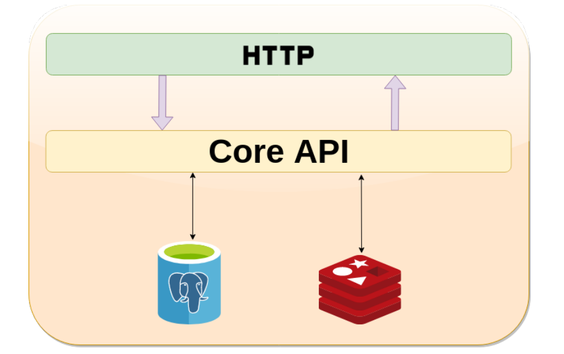

# Архитектура

Помимо HTTP API будет использоваться БД PostgreSQL и кэширование в Redis (для хранения токенов и прочей информации вроде текущей тележки товаров пользователя).

## Стэк

- cats;
- cats-effect;
- cats-mtl - тайпклассы для монадных трансформеров;
- cats-retry - перезапросы сфейленных действий;
- circe;
- ciris - библиотека конфигураций;
- fs2 - стримы;
- http4s;
- http4s-jwt-auth - для аутентификации на JWT;
- log4cats - логи в Cats;
- meow-mtl;
- newtype - обёртки для типизированных функций;
- redis4cats;
- refined - типы для валидации;
- skunk - неблокирующий PostgreSQL клиент;
- squants - типы для измерений вроде денег.

