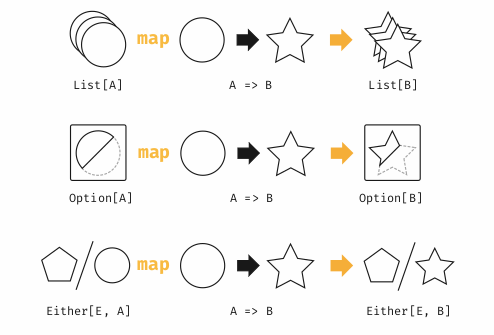

# Функторы

**Функторы** - это абстракция, позволяющая представлять последовательности операций внутри контекстов вроде `List`, `Option` и других. Сами по себе функторы не очень полезны, но их особые разновидности - **монады** и **аппликативные функторы** - одни из самых востребованных абстракций Cats.

## Примеры функторов

Неформально говоря, функтор - это что угодно с методом `map` внутри. Например, `Option`, `List`, `Either`. 

Обычно впервые мы узнаём о `map` когда итерируем по листам. 

Но чтобы понять функторы - нужно думать о `map` в другом ключе. Метод `map` не ходит по коллекции, он трансформирует все её значения за один запуск. Мы указываем функцию - и `map` выполняет её для всех элементов:

```scala
List(1,2,3).map(n => n + 1)
```

Похожим образом, когда мы используем `map` на `Option`, мы трансформируем контент, но **контекст** Some или None остаётся нетронутым.



*Mapping по коллекциям*

Контекст - вот что сохраняется между разными вызовами `map` на любых коллекциях.

`map` сохраняет структуру контекста, поэтому его можно вызвать повторно сколько угодно раз:

```scala
List(1, 2, 3).
  map(n => n + 1).
  map(n => n * 2).
  map(n => n + "!")
  // res1: List[String] = List(4!, 6!, 8!)
```

Таким образом, map - это не паттерн итерации, но возможность упорядоточить вычисления значений игнорируя особенности конкретных типов данных. 