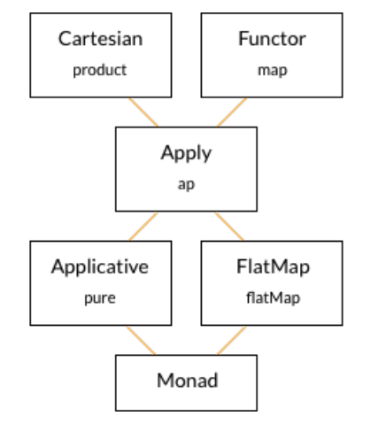

# Иерархия тайпклассов для создания последовательностей

Теперь мы можем увидеть и понять всё семеёство тайпклассов, которые предназначены для создания последовательных вычислений.

Отсюда мы можем извлечь несколько свойств:

- Каждая монада является аппликативным функтором;
- Каждый аппликативный функтор является semigroupal.

Чем более конкретную абстракцию мы выберем для нашего типа данных - тем меньше поведений мы сами можем реализовать. Но тем больше поведений мы можем гарантировать.

Монады достаточно гибки для моделирования широкого набора поведений и достаточно строги для создания гарантий этих поведений. Но иногда они не подходят.

Монады создают последовательные вычисления, а аппликативные функторы и semigroupal-ы - нет. Поэтому они могут быть использованы там, где монады не могут. 

Если мы выбираем монады - мы получаем последовательность. Если мы выбираем аппликативные функторы - мы теряем `flatMap`, но получаем конкурентность. Об этом следует помнить.