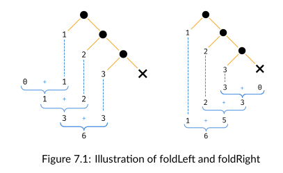

# Foldable

`Foldable` - это тайпкласс, хранящий методы foldLeft и foldRight. Через него мы можем создавать обобщённые свёртки, которые работают с различными последовательными типами.

## Folds and folding

```scala
def show[A](list: List[A]): String =
  list.foldLeft("nil")((accum, item) => s"$item then $accum")

def showr[A](list: List[A]): String =
  list.foldRight("nil")((accum, item) => s"$item then $accum")


show(List(1,2,3))  // res0: String = 3 then 2 then 1 then nil
showr(List(1,2,3))  // res1: String = nil then 3 then 2 then 1

```

Общая концепция свёртывания: мы задаём аккумулятор и бинарную функцию для комбинации каждого элемента посследовательности.

`foldLeft` рекурсивно проходит по коллекции. Для каждого элемента срабатывает функция. Результат этой функции становится аккумулятором в рекурсивном вызове для следующего элемента. Когда вся коллекция пройдена - аккумулятор становится результатом.

Порядок обхода может быть выжен:

- `foldLeft` ходит слева-направо (от начала к концу);
- `foldRight` ходит справа-налево (от конца к началу).

Например:

```scala
List(1, 2, 3).foldLeft(0)(_ + _)
// res2: Int = 6
List(1, 2, 3).foldRight(0)(_ + _)
// res3: Int = 6
```



В этих функциях Right и Left указывает начало, а не направление. foldRight складывает справа-налево, а foldLeft - слева-направо. 

Это может начать играть роль, когда оператор не ассоциативен:

```scala
List(1, 2, 3).foldLeft(0)(_ - _)
// 0 - 1 - 2 - 3
// -6

List(1, 2, 3).foldRight(0)(_ - _)
// 3 - 0 = 3
// 2 - 3 = -1
// 1 - (-1) = 2
// 2
```

## Exercise: Reflecting on Folds

Попробуйте использовать fold с пустым листом в качестве аккумулятора и :: в качестве оператора.

```scala
// List(1,2,3).foldLeft(List.empty[Int])(_ :: _)  // :: not a member of int
List(1,2,3).foldRight(List.empty[Int])(_ :: _)  // res2: List[Int] = List(1, 2, 3)


// Nil :: 1  // :: not a member of int
1 :: Nil
```

К листу можно прибавлять только спереди, поэтому конструкция Nil :: 1 не срабатывает.


## Exercise: Scaf-fold-ing Other Methods

Реализовать map, flatMap, filter и sum через `foldRight`:

```scala
def mymap[A, B](list: List[A])(f: A => B): List[B] =
    list.foldRight(List.empty[B])((e, a) => f(e) :: a)

def myflatMap[A, B](list: List[A])(f: A => List[B]): List[B] =
    list.foldRight(List.empty[B])((e, a) => f(e) ++ a)

def myfilter[A](list: List[A])(p: A => Boolean): List[A] =
    list.foldRight(List.empty[A]) {
      case (e, a) if p(e) => e :: a
      case (e, a)         => a
    }

def mysum[A: Numeric](list: List[A]): A =
    list.foldRight(Numeric[A].zero)((e, a) => Numeric[A].plus(e, a))

mymap(List(1, 2, 3))(a => a * 2)
myflatMap(List(1, 2, 3))(a => List(a.toString + "!"))
myfilter(List(1, 2, 3))(a => a > 2)
mysum(List(1, 2, 3))

// res3: List[Int] = List(2, 4, 6)
// res4: List[String] = List(1!, 2!, 3!)
// res5: List[Int] = List(3)
// res6: Int = 6
```

Однако, в последнем случае наиболее верным будет наиболее обобщённое решение, позволяющее складывать не только числа:

```scala
import cats.Monoid
def monoidSum[A](list: List[A])(implicit monoid: Monoid[A]): A =
  list.foldRight(monoid.empty)(monoid.combine(_,_))
```


